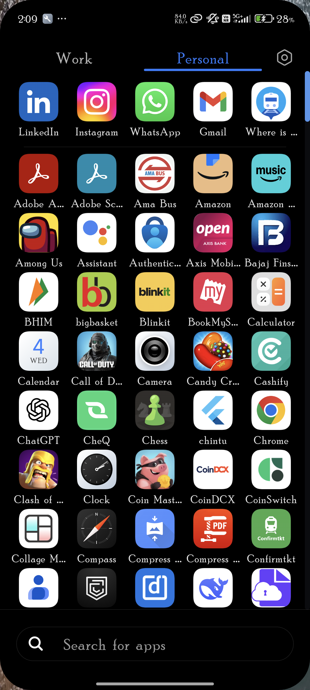

# QuickHelp

QuickHelp is a service booking application built with **Flutter**. It connects users with local service providers efficiently, offering a seamless and beautiful user experience.

## Screenshots

<p align="center">
  
  
</p>

## Run Locally

1.  **Prerequisites**:
    *   [Flutter SDK](https://docs.flutter.dev/get-started/install) installed.
    *   An emulator or physical device connected.

2.  **Clone the repository**:
    ```bash
    git clone https://github.com/NilakanthaPradhan/QuickHelp.git
    cd quickhelp
    ```

3.  **Install dependencies**:
    ```bash
    flutter pub get
    ```

4.  **Run the app**:
    ```bash
    flutter run
    ```

## Deploy to Render (Web)

QuickHelp can be deployed as a static web application on Render.

1.  **Build for Web**:
    Run the following command to generate the static files:
    ```bash
    flutter build web
    ```

2.  **Create a Static Site on Render**:
    *   Go to [Render Dashboard](https://dashboard.render.com/).
    *   Click **New +** -> **Static Site**.
    *   Connect this GitHub repository.

3.  **Configure Settings**:
    *   **Build Command**: `flutter build web`
    *   **Publish Directory**: `build/web`
    *   *Note: You may need to use a Render Blueprint or specific environment settings for Flutter if not recognized automatically, but serving the pre-built `build/web` folder is the standard static hosting method.*
